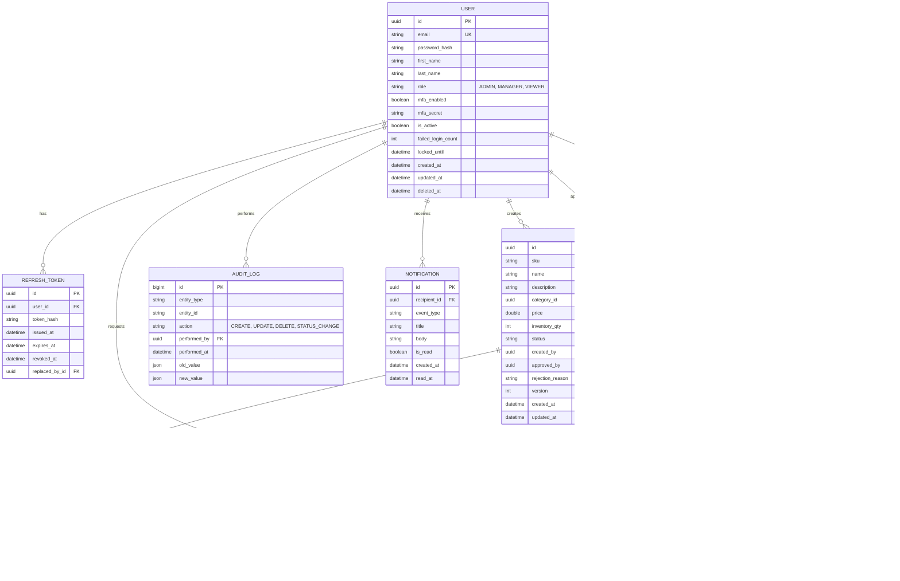

# Entity Relationship Diagram: Product Management Ecosystem

## Relationships Summary

1.  **Users & Tokens**: One user can have many refresh tokens (multiple devices/sessions).
2.  **Product Lifecycle**: A product is created by one user (Manager) and approved/rejected by another (Admin).
3.  **Categories**: Hierarchical tree structure where a category can have a parent category.
4.  **Audit & Notifications**: Global tracking of actions linked to users; notifications linked to recipients.
